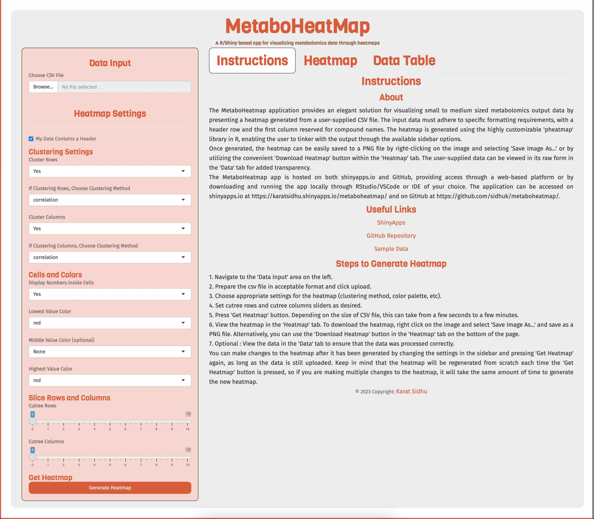

# MetaboHeatMap

## A R/Shiny based app for visualizing metabolomics data through heatmaps

Available online at [here](https://karat.shinyapps.io/MetaboHeatMap/) or locally using the source code in this repository.

_The Shiny App Home Page_

## Introduction

MetaboHeatMap is a R/Shiny based app for visualizing metabolomics data through heatmaps. It is designed to be used mainly for small to medium sized metabolomics datasets. Ideally, the data is normalized and filtered before being used in the app. The app can be used in two ways:

1. **Online**: The app is available online at [here](https://karat.shinyapps.io/MetaboHeatMap/). The app is hosted on a free account and may be slow at times. The app is also limited to 25 concurrent users. If you are unable to access the app, please try again later, or contact me on [Twitter](https://twitter.com/karat_sidhu) or [Mastodon](https://mas.to/@karat) and I will try my best to resolve the issue.

2. **Locally**: The app can be run locally using the source code in this repository. Any IDE configured to run R/Shiny apps can be used.

## Features

## Data Format

## Data Preprocessing

## Data Upload

## Data Visualization

## Usage

## Installation

### To run the app locally:
